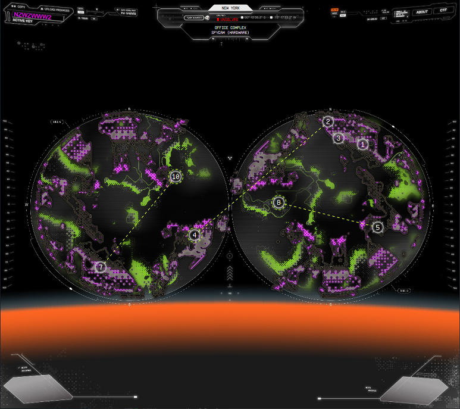
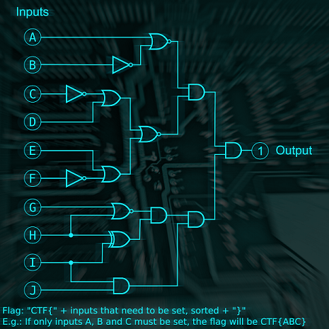

# Google CTF Beginners Quest

Google CTF のビギナー向け問題。  
2021のものが継続してやれるみたい。

work in progress



## 1 CCTV (rev)

画面に正しいパスワードを入力すればOK。  
パスワードは、jsで求めているので、そこから逆算。

```js
const checkPassword = () => {
  const v = document.getElementById("password").value;
  const p = Array.from(v).map(a => 0xCafe + a.charCodeAt(0));

  if(p[0] === 52037 &&
     p[6] === 52081 &&
     p[5] === 52063 &&
     p[1] === 52077 &&
     p[9] === 52077 &&
     p[10] === 52080 &&
     p[4] === 52046 &&
     p[3] === 52066 &&
     p[8] === 52085 &&
     p[7] === 52081 &&
     p[2] === 52077 &&
     p[11] === 52066) {
    window.location.replace(v + ".html");
  } else {
    alert("Wrong password!");
  }
}
```

```js
[52037,52077,52077,52066,52046,52063,52081,52081,52085,52077,52080,52066].map(a => a - 0xCafe).map(a => String.fromCharCode(a)).join('')
>> `GoodPassword`
```

Flag: `CTF{IJustHopeThisIsNotOnShodan}`


## 2 Logic Lock (misc)

file: logick-lock.png

```
It’s a cold day, and the snow is falling horizontally. It pierces your sight. You better use those extra pairs of socks that you were strangely given by the driver. Someone is waving on the other side of the street. You walk over to her. "Hi AGENT, I’m AGENT X, we’ve found the apartment of a person that we suspect got something to do with the mission. Come along!."

Challenge: Logic Lock (misc)
It turned out suspect's appartment has an electronic lock. After analyzing the PCB and looking up the chips you come to the conclusion that it's just a set of logic gates!
```



論理回路の画像が渡されるので、Outputが1になるための必要条件を求めるだけ。

Flag: `CTF{BCFIJ}`

## 3 High Speed Chase (misc)

```
The person drives into a narrow back alley and despite the danger you try to continue on and give chase. It is impossible to see who they are, clothed all in black and a helmet covering the face. You need to intercept them somehow.

Challenge: High Speed Chase (misc)
You chase them through city streets until you reach the high way. The traffic is pretty rough for a car and you see them gaining ground - should have hotwired a motorbike as well! Too late for that. You look around your car to spot anything useful, and you notice this is actually one of the new self driving cars. You turn on the autopilot, pull out your laptop, connect it to the system, and enter the not-so-hidden developer's mode. It's time to re-program the autopilot to be a bit more useful in a chase! To make it easier, you replace the in-car LiDAR feed with a feed from an overhead sattelite - you also display it on the the entertainment system. Now all that's left to do, is to write a better controlCar function!
```

車をすべて抜けるようにJavaScriptプログラムを書けばよい。  
(もう少しスマートな解法ありそうだが、とりあえずこれで良しとする。)

```
console.log(scanArray);

var my1 = scanArray[7];
var my2 = scanArray[8];
var my3 = scanArray[9];
var max = Math.max(...scanArray);
if (my1 == my2 && my2 == my3) {
  if (max == scanArray[8]) {
    console.log('z');
    return 0;
  }
}

var index = scanArray.findIndex(v => v == max);
if (my1 == max) {
  return index - 9;
}
if (my3 == max) {
  return index - 7;
}
return index - 8;
```

Flag: `CTF{cbe138a2cd7bd97ab726ebd67e3b7126707f3e7f}`

## 4 Electronics Research Lab (hw)

```
"Welcome back AGENT. It seems like you've got a marvelous lead that perhaps gives a clue about where you should head to next. Visit the lab, and talk to that Dr. Klostermann, or is it Cloysterman?, he will know how to decrypt the device.. you would think". ... Dr Klostermann: "Welcome to the technical department AGENT, I’m Dr. Klostermann, and this is my assistant, Konstantin. Let’s not waste any time, is that the device that you’re holding in your hand? Konstantin, start the basic procedure."

Challenge: Electronics Research Lab (hw)
Welcome back AGENT. It seems like you got a lead that perhaps gives a clue about where the next journey on your quest goes. Visit the lab, and talk to Dr. Klostermann, he will know how to decrypt the device Note: If you solved the challenge before but could not submit the flag, please try again, we had the wrong flag in our database.
```

解けてない


## 5 Twisted robot (misc)

```
It’s a hot day, and your skin is cracking and dry. It’s difficult to make your way through the crowded bazaar. A high pitch voice pierces through the soundscape from a salesman that’s trying to sell colorful fabrics and then from another corner comes delicious smells. You spot a hand waving - it’s your contact that you’ve been waiting to meet. "Take a seat, my friend, I’m Gökhan, have you been to Istanbul before? No, really? I’m sure that you will have a great time, I’ve ordered tea for the two of us. Show me the amulet, will you?. Wow, this is really something from my younger days, this is as mysterious as it is beautiful and belongs to “The cloaked brotherhood”. They are very dangerous, and eventhough your quest is urgent, I would advise you to not continue looking for the owner of this. Go home, and forget about it." In the blink of an eye, four tough guys show up, and you start to run together with Gökhan through the crowded marketplace and then up on a rooftop. The tough guys are closing in, but the two of you climb down from the rooftop, run around a corner and are able to hide in two crates.

Challenge: Twisted robot (misc)
We found this old robo caller. It basically generates random phone numbers to spam. We found the last list of numbers in generated and also some weird file... Maybe it's got to do with these new beta features they were testing?
```

Pythonのrandomモジュールは、Mersenne Twisterを用いて疑似乱数を生成している。  
乱数生成された文字列が624個与えられているため、それ以降の乱数生成を予測することができる。  
乱数が予測できれば、後はXORするだけ。

今回利用したツール：RandCrack https://github.com/tna0y/Python-random-module-cracker  
参考：https://inaz2.hatenablog.com/entry/2016/03/07/194147  


- RoboCaller1337.py

```python
import random

# Gots to get that formatting right when send it to our call center
def formatNumber(n):
    n = str(n)
    return f'{n[:3]}-{n[3:6]}-{n[6:]}'

# This generates random phone numbers because it's easy to find a lot of people!
# Our number generator is not great so we had to hack it a bit to make sure we can
# reach folks in Philly (area code 215)
def generateRandomNumbers():
    arr = []
    for i in range(624):
        arr.append(formatNumber(random.getrandbits(32) + (1<<31)))
    return arr

def encodeSecret(s):
    key = [random.getrandbits(8) for i in range(len(s))]
    return bytes([a^b for a,b in zip(key,list(s.encode()))])


def menu():
    print("""\n\nWelcome to the RoboCaller!! What would you like to do?
1: generate a new list of numbers
2: encrypt a super secret (in beta)
3: decrypt a super secret (coming soon!!)
4: exit""")
    choice = ''
    while choice not in ['1','2','3']:
        choice = input('>')
        if choice == '1':
            open('robo_numbers_list.txt','w').write('\n'.join(generateRandomNumbers()))
            print("...done! list saved under 'robo_numbers_list.txt'")
        elif choice == '2':
            secret = input('give me your secret and I\'ll save it as "secret.enc"')
            open('secret.enc','wb').write(encodeSecret(secret))
        elif choice == '3':
            print("stay tuned for this awesome feature\n\n")
        elif choice == '4':
            print("Thank you for using RoboCaller1337!")
    return

def main():
    while True:
        menu()

if __name__ == "__main__":
    main()
```

- solve.py

```python
import random, time
from randcrack import RandCrack

def formatNumber(n):
    n = str(n)
    return f'{n[:3]}-{n[3:6]}-{n[6:]}'

def to_number(s: str) -> int:
    s = s.replace('-', '').strip()
    return int(s)

def encodeSecret(s):
    key = [random.getrandbits(8) for i in range(len(s))]
    return bytes([a^b for a,b in zip(key,list(s.encode()))])

def read_rand_numbers(file = './robo_numbers_list.txt'):
    with open(file) as f:
        lines = f.readlines()
    return [to_number(i) - (1<<31) for i in lines]

def read_enc(file = './secret.enc'):
    with open(file,mode='rb') as f:
        line = f.read()
    return line

def main():
    rand_numbers = read_rand_numbers()
    enc = read_enc()

    rc = RandCrack()
    for n in rand_numbers:
        rc.submit(n)

    flag = []
    for e in enc:
        flag.append(chr(rc.predict_getrandbits(8) ^ e))
    print(f'flag: {"".join(flag)}')

if __name__ == '__main__':
    main()
```

Flag: `CTF{n3v3r_3ver_ev3r_use_r4nd0m}`

## ReadySetAction (crypto)

```
You are showing the invitation so that you can enter the conference. There are hundreds of important looking people at the conference. You take a glass of champagne from a tray, and try to look important yourself. After being busy with trying to look important for a few minutes, you approach the person that you are here to get classified information from. He introduces himself as Dr. Nowak Wasilewski. Nowak asks who you are, and if you can prove your knowledge through a test that he has designed by himself.

Challenge: ReadySetAction (crypto)
Apparently this script was used to encrypt super secret messages. Maybe there is something interesting in it? NOTE: this challenge was previously broken, redownload to get the correct file.
```

RSA暗号でeが小さい。  
Low Public-Exponent Attackすればいいが、`m^e < n` ではない(=gmpy2.iroot(c,e)だけでは解けない)。  
参考：https://norio567.hatenablog.com/entry/2019/06/07/214800

- chall.py

```python
from Crypto.Util.number import *

flag = b"REDACTED"

p = getPrime(1024)
q = getPrime(1024)
n = p*q

m = bytes_to_long(flag)

c = pow(m,3,n)

print(c)
print(n)
#15478048932253023588842854432571029804744949209594765981036255304813254166907810390192307350179797882093083784426352342087386691689161026226569013804504365566204100805862352164561719654280948792015789195399733700259059935680481573899984998394415788262265875692091207614378805150701529546742392550951341185298005693491963903543935069284550225309898331197615201102487312122192298599020216776805409980803971858120342903012970709061841713605643921523217733499022158425449427449899738610289476607420350484142468536513735888550288469210058284022654492024363192602734200593501660208945967931790414578623472262181672206606709
#21034814455172467787319632067588541051616978031477984909593707891829600195022041640200088624987623056713604514239406145871910044808006741636513624835862657042742260288941962019533183418661144639940608960169440421588092324928046033370735375447302576018460809597788053566456538713152022888984084306297869362373871810139948930387868426850576062496427583397660227337178607544043400076287217521751017970956067448273578322298078706011759257235310210160153287198740097954054080553667336498134630979908988858940173520975701311654172499116958019179004876438417238730801165613806576140914402525031242813240005791376093215124477
```

- solve.py

```python
import gmpy2
from Crypto.Util.number import long_to_bytes

def decrypto(c, e, n):
    while(True):
        m, result = gmpy2.iroot(c, e)
        if result:
            return m
        else:
            c += n

if __name__ == '__main__':
    n=21034814455172467787319632067588541051616978031477984909593707891829600195022041640200088624987623056713604514239406145871910044808006741636513624835862657042742260288941962019533183418661144639940608960169440421588092324928046033370735375447302576018460809597788053566456538713152022888984084306297869362373871810139948930387868426850576062496427583397660227337178607544043400076287217521751017970956067448273578322298078706011759257235310210160153287198740097954054080553667336498134630979908988858940173520975701311654172499116958019179004876438417238730801165613806576140914402525031242813240005791376093215124477
    e=3
    c=15478048932253023588842854432571029804744949209594765981036255304813254166907810390192307350179797882093083784426352342087386691689161026226569013804504365566204100805862352164561719654280948792015789195399733700259059935680481573899984998394415788262265875692091207614378805150701529546742392550951341185298005693491963903543935069284550225309898331197615201102487312122192298599020216776805409980803971858120342903012970709061841713605643921523217733499022158425449427449899738610289476607420350484142468536513735888550288469210058284022654492024363192602734200593501660208945967931790414578623472262181672206606709

    m = decrypto(c, e, n)
    print(long_to_bytes(m))
```

Flag: `CTF{34sy_RS4_1s_e4sy_us3}`

## 8 Hide and seek (misc)

```
 You arrive at the location through the coordinates that you got from the assassin, a luxurious yacht. A fat, bald man lies on a puma couch. He sips on a dry martini, smokes the biggest cigar you've ever seen and when he smiles, a golden tooth is revealed. You can’t help but smile back at him, although you think the place seems shady. "Welcome to my yacht, Johnson, finally you show us your face. Have you killed the AGENT now? Good! You’re here to collect your reward I presume? I’ll have my guy finalize the transaction but before you leave I need a small favour from you." It seems that he is mistaking you for the assassin but you don’t mind.

Challenge: Hide and seek (misc)
The man hands you a pendrive which you reluctantly connect to your laptop. He says he got it from a partner, and the partner claims that he hid valuable information in that PNG there. The problem is, it looks empty. See if you can find anything.
```

真っ黒のpng画像が与えられる。  
解けてない

## 10 Spycam (hardware)

```
New York is hot, and you are on your way to the office complex. It seems like it is well guarded, even though you are expected under the alias of the assassin, perhaps it will be a better idea to sneak inside the building, unseen? You climb through a window on the side of the building. Inside you spot more guards, quick, hide behind a desk. Now you have to sneak past the guards into the main office.

Challenge: Spycam (hardware)
You manage to find some exposed wires and quickly hook them up to your portable terminal. It seems to be a live feed of the internal CCTV system. If you can manage to decode the signal you might find something interesting, maybe a code or a password to get past the locked door.
```

CSVファイルが数ファイル与えられる。
解けてない
